# Harmonic

Navidrome的鸿蒙原生客户端，适配手机、平板、车机。

## 应用截图

### 手机

#### 浅色

  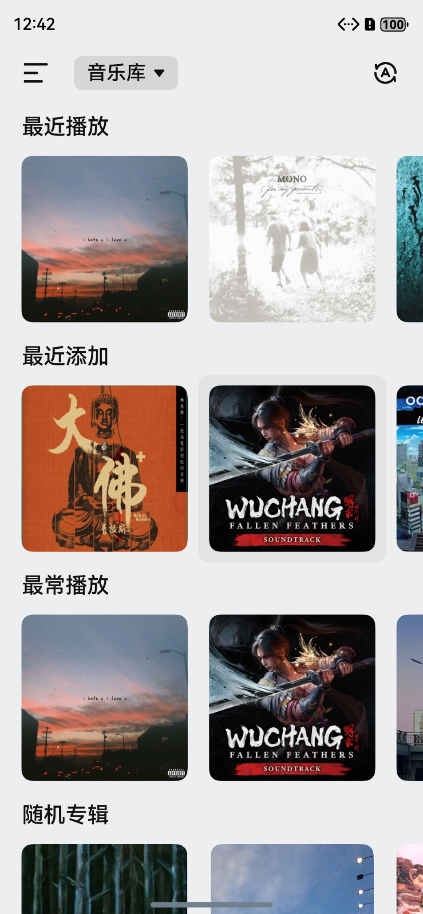
  
  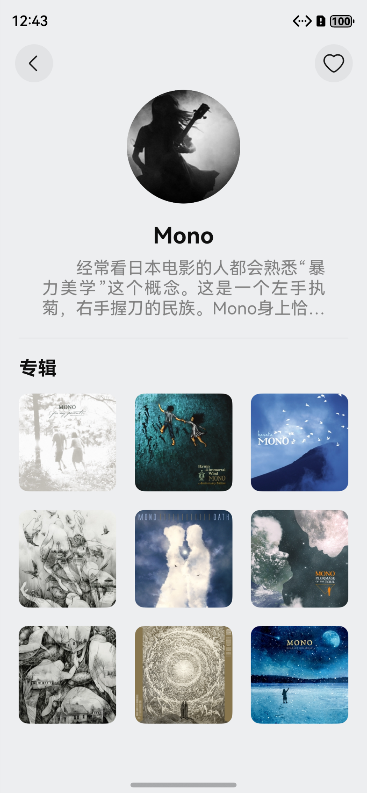
  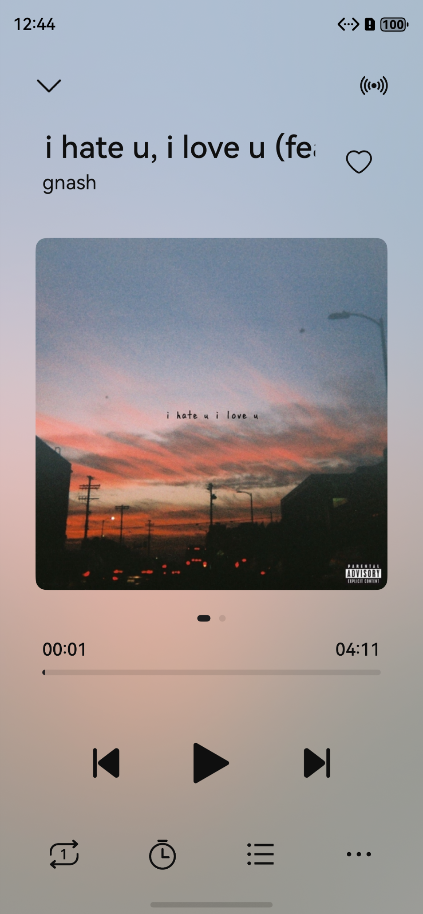
  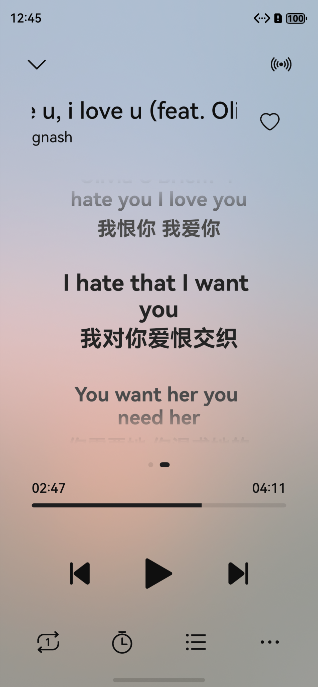

#### 深色

  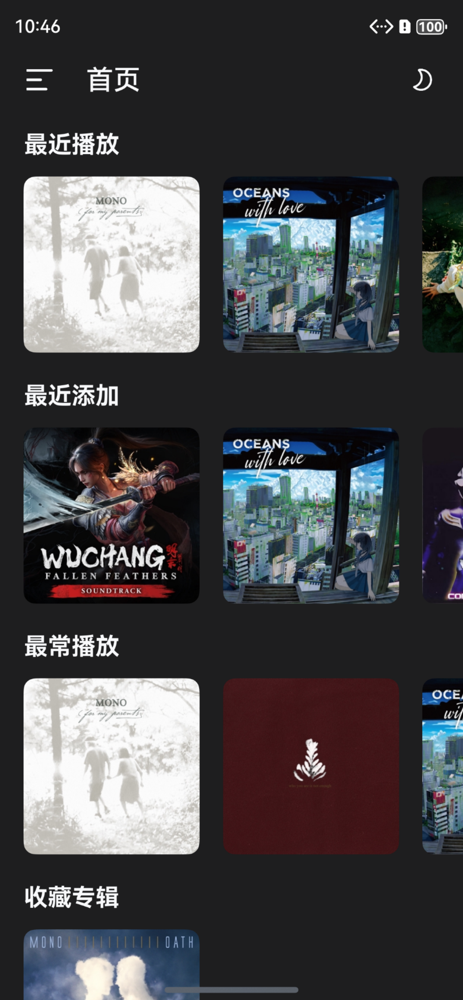
  
  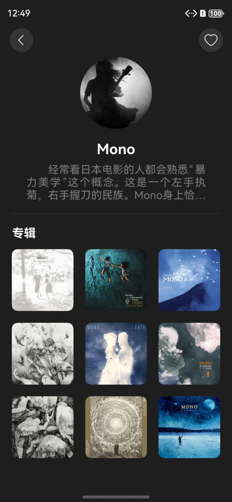
  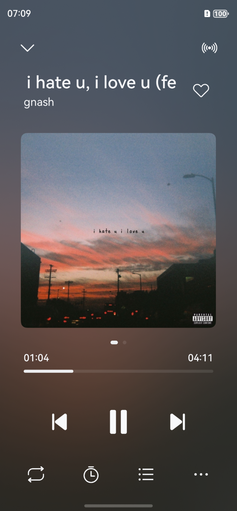
  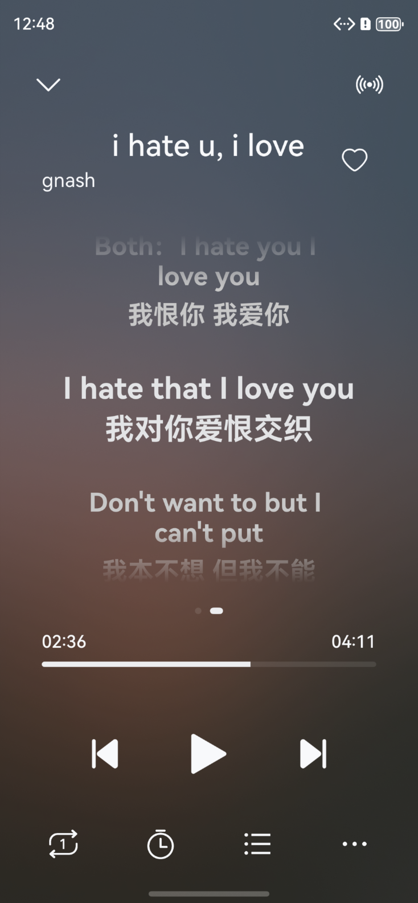

### 平板/折叠屏/PC

#### 浅色

  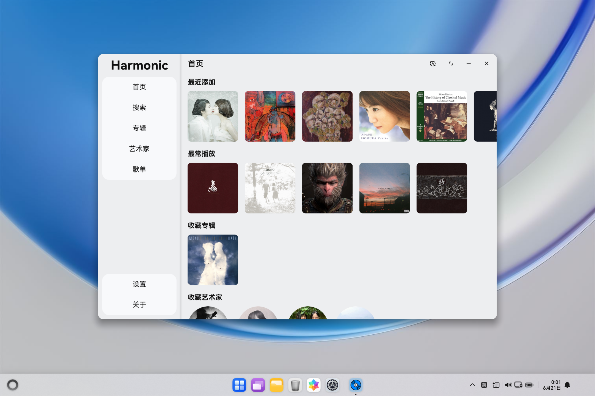
  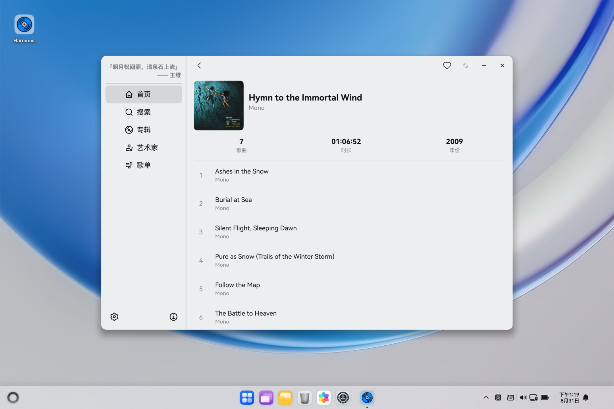
  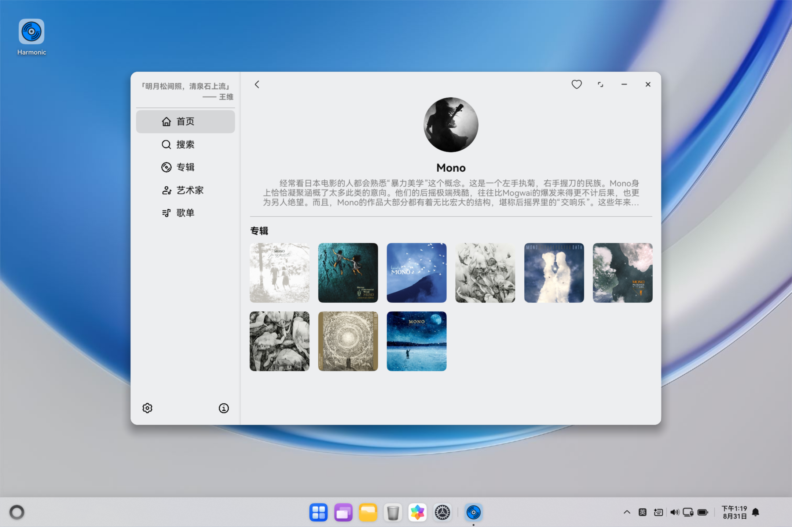
  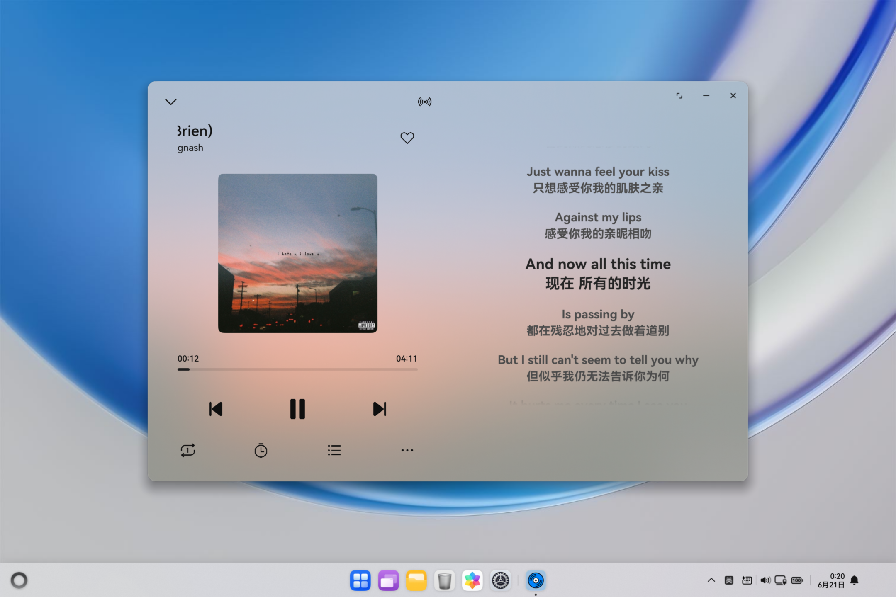

#### 深色

  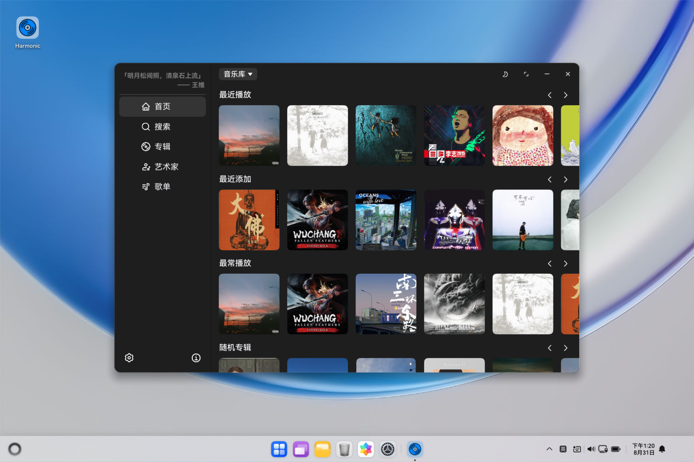
  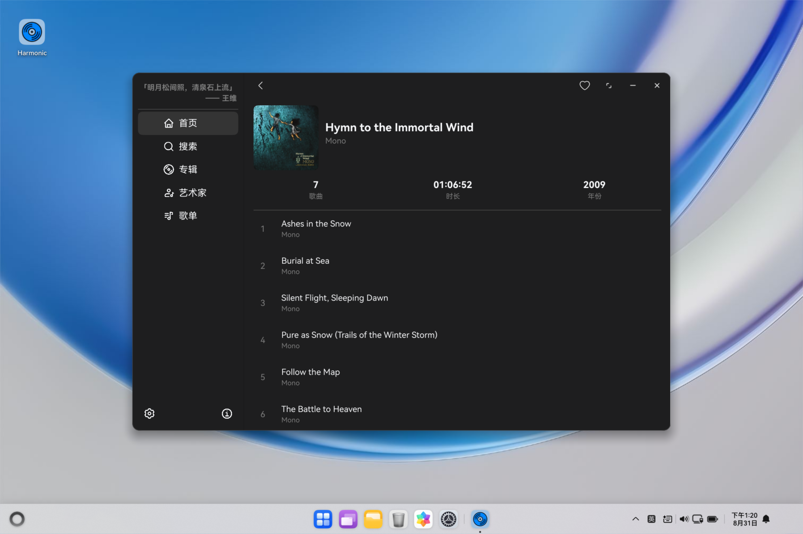
  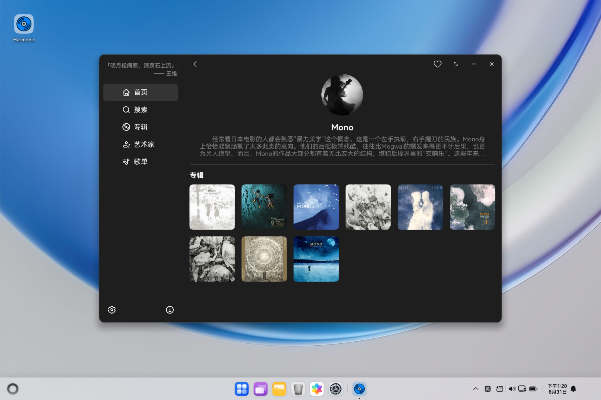
  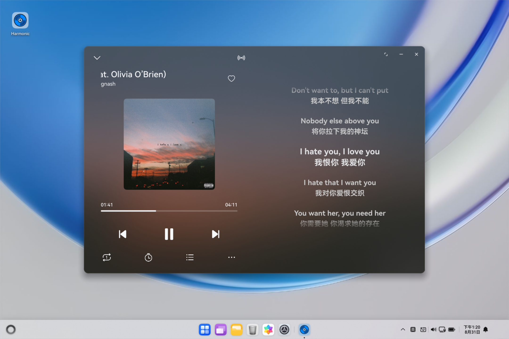

## 安装方式

### 邀请测试

将以下链接复制到华为浏览器打开：

https://appgallery.huawei.com/link/invite-test-wap?taskId=6d0f609491867a5f53c2f8e1ada64929

### 自行侧载

推荐使用[auto-installer](https://github.com/likuai2010/auto-installer)进行安装。
